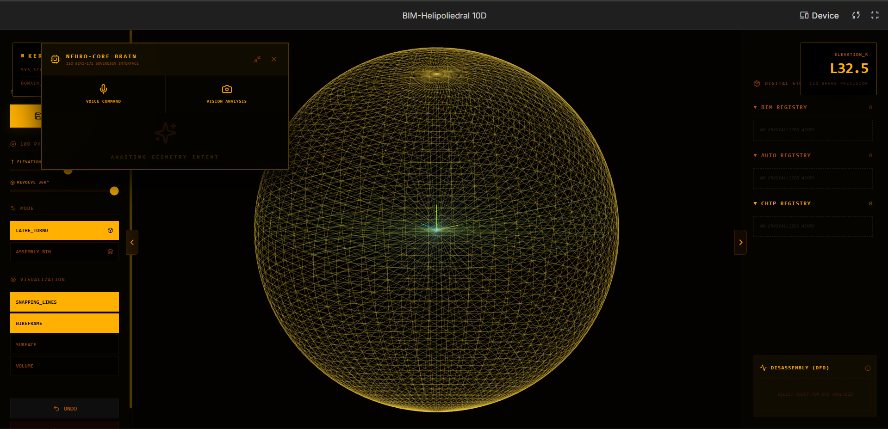

# BIM-Helipoliedral 10D - Gemini 3 Hackathon
High-performance spatial engineering engine with 10D topological validation, orchestrated by Gemini 3.

<em>Fig 1. Repository Structure Visualization and Kernel Synchronization</em>

🖥️ Interface & Neuro-Core Control
Below is the manifestation environment operating within Google AI Studio, highlighting the multimodal command terminal:

<em>Fig 2. Sovereign Neuro-Core Terminal and 10D Engineering Viewport</em>

🚀 **Live Demo**
[Acesse o App no AI Studio](https://ai.studio/apps/drive/1nIu_pYqz78FuHCNUwcB9NNIVhS_coIE7?fullscreenApplet=true)

🛠️ **Tech Stack**
- **Core:** Rust + WebAssembly (WASM) / Theta Core
- **AI:** Gemini 3 Pro API (NeuroCore Orchestration via Action Tokens)
- **Frontend:** Leptos (Rust) / Three-d (WebGL Rendering). High-density analytical HUD with WebGL rendering for the Design for Disassembly (DfD) interface
- **Database:** SurrealDB (LocalHost First)
- **Compliance:** ISO 80000 (precision), ISO 19650 (lifecycle management), and ISO 20887 (sustainability)

🚀 Key Innovation: NeuroCore Orchestration
The central innovation lies in the Gemini 3 Pro API acting as a "NeuroCore". Instead of a conventional chatbot, the Kernel emits Action Tokens (JSON) to manipulate 10D point arrays, enabling autonomous topological validation loops.

🔒 **License & IP**
**All Rights Reserved.** This software is currently under registration at **INPI** (Brazilian Industrial Property Institute). Private source code provided for contest evaluation and authorized audits only.

  
<b>🇧🇷 Clique aqui para ver a versão em Português (Brasil)</b>

  # BIM-Helipoliedral 10D - Gemini 3 Hackathon

  Motor de engenharia espacial de alta performance com validação topológica 10D, orquestrado pelo Gemini 3.

  

    
     
    <em>Fig 1. Visualização da Estrutura do Repositório e Sincronização do Kernel</em>
  

  ---

  ### 🖥️ Interface e Controle Neuro-Core
  Abaixo está o ambiente de manifestação operando dentro do Google AI Studio, destacando o terminal de comando multimodal:

  

    
     
    <em>Fig 2. Terminal Neuro-Core Soberano e Viewport de Engenharia 10D</em>
  

  ### 🚀 Demonstração ao Vivo
  [Acesse o App no AI Studio](https://ai.studio/apps/drive/1nIu_pYqz78FuHCNUwcB9NNIVhS_coIE7?fullscreenApplet=true)

  ### 🚀 Inovação Chave: Orquestração NeuroCore
  A inovação central reside na **Gemini 3 Pro API** atuando como um "NeuroCore". Em vez de um chatbot convencional, o Kernel emite **Tokens de Ação (JSON)** para manipular arrays de pontos 10D, permitindo loops autônomos de validação topológica.

  ### 🛠️ Pilha de Tecnologia (Tech Stack)
  - **Core:** Rust + WebAssembly (WASM) / Theta Core
  - **IA:** Gemini 3 Pro API (Orquestração NeuroCore via Action Tokens)
  - **Frontend:** Leptos (Rust) / Three-d (Renderização WebGL). HUD analítico de alta densidade para a interface Design for Disassembly (DfD).
  - **Banco de Dados:** SurrealDB (LocalHost First)
  - **Conformidade:** ISO 80000 (precisão), ISO 19650 (gestão do ciclo de vida) e ISO 20887 (sustentabilidade)

  ### 🔒 Licença e PI
  **Todos os Direitos Reservados.** Este software está atualmente em processo de registro no **INPI** (Instituto Nacional da Propriedade Industrial). Código-fonte privado fornecido apenas para avaliação de concurso e auditorias autorizadas.

