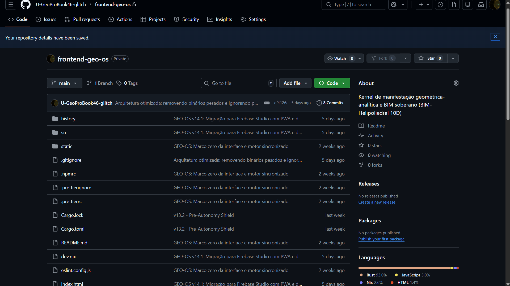

# BIM-Helipoliedral 10D - Gemini 3 Hackathon

High-performance spatial engineering engine with 10D topological validation, orchestrated by Gemini 3.

  
   
  <em>Fig 1. Visualização da Estrutura do Repositório e Sincronia do Kernel</em>

🚀 **Live Demo**
[Acesse o App no AI Studio](https://ai.studio/apps/drive/1nIu_pYqz78FuHCNUwcB9NNIVhS_coIE7?fullscreenApplet=true)

🛠️ **Tech Stack**
- **Core:** Rust + WebAssembly (WASM) / Theta Core
- **AI:** Gemini 3 Pro API (NeuroCore Orchestration via Action Tokens)
- **Frontend:** Leptos (Rust) / Three-d (WebGL Rendering)
- **Database:** SurrealDB (LocalHost First)

🔒 **License**
All Rights Reserved. Private source code for contest evaluation.
